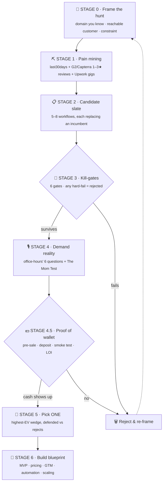

<div align="center">

# 🎯 idea-hunt

### Find a painful workflow AI can replace — then prove people will pay, *before* you build.

**An open-source [Claude](https://claude.ai) skill for evidence-first AI business idea discovery & validation.**
It doesn't invent ideas from a blank page. It hunts for workflows people *already pay to fix* — and kills the weak ones on paper in an afternoon.

<br/>

[](./LICENSE)
[](https://docs.claude.com/en/docs/claude-code/skills)
[](./SKILL.md)
[](#-contributing)
[](./SKILL.md)

<sub>Built for founders · indie hackers · solo builders · micro-SaaS makers</sub>

</div>

---

<div align="center">

**[What is it?](#-what-is-idea-hunt) · [Why](#-why-it-exists) · [Pipeline](#-how-it-works) · [Install](#-installation) · [Usage](#-usage) · [FAQ](#-faq)**

</div>

---

## 💡 What is idea-hunt?

> **idea-hunt is a Claude skill that finds and validates AI business ideas by starting from real, evidence-backed customer pain instead of imagination.**

It runs a **7-stage pipeline** — frame → mine pain → slate candidates → apply kill-gates → test demand → prove willingness-to-pay → build blueprint — so most weak ideas die *before* you write a line of code.

It's built around one governing fact:

<table>
<tr>
<td width="50%" align="center">

### 42%
of startups fail because there is **no market need**
<sub>— #1 cause of failure (CB Insights)</sub>

</td>
<td width="50%" align="center">

### 60–70%
of AI **"wrappers" earn $0**, and ~90% are expected dead by end-2026
<sub>— AI-wrapper revenue reports</sub>

</td>
</tr>
</table>

**idea-hunt exists to fail those ideas on paper — cheaply — instead of in the market over six months.**

---

## 🔥 Why it exists

Most "AI startup idea" prompts ask a model to invent something from nothing. You get vague, undefensible, me-too ideas nobody pays for. idea-hunt does the opposite:

| | ❌ The usual prompt | ✅ idea-hunt |
|---|---|---|
| **Starting point** | Invent an idea, hope demand exists | Find a workflow people **already pay for** |
| **What you sell** | "A tool for X" (a seat) | The **finished outcome** (Service-as-Software) |
| **Validation** | "Would you use this?" | **Proof of wallet** — a deposit, pre-sale, or paid pilot |
| **Output** | One idea, rationalized | Most ideas **rejected**; one wedge, defended |
| **Result** | A wall of generic features | A validated, buildable, defensible wedge |

> 💰 If someone pays a freelancer **₹40,000/month** for a task you can automate for **₹4,000**, they've *already told you the price.* That's a **painkiller** — and idea-hunt hunts painkillers, not vitamins.

---

## ⚙️ How it works



<div align="center"><sub>Never jump straight to Stage 6. The whole point is that most ideas die at Stages 3–4.5.</sub></div>

<br/>

<details>
<summary><b>📖 Expand: what each stage actually does</b></summary>

<br/>

| Stage | What happens |
|-------|--------------|
| **0 · Frame** | Pick the search surface — a domain you know, a customer you can reach in 72h, a constraint (B2B/B2C, budget, geography). |
| **1 · Pain mining** | Surface real complaints & proof of spend: `last30days` + **G2/Capterra 1–3★ feature-gap reviews** + **Upwork/Fiverr gigs** (a posted gig is a *purchase order*). |
| **2 · Candidate slate** | Turn pain into 5–8 candidates, each phrased as *replacing a specific incumbent and selling the finished outcome*. |
| **3 · Kill-gates** | Score every candidate against 6 gates — painkiller, AI-native fit, reachable owner, urgency, buildability, durable moat. Any hard-fail = rejected. |
| **4 · Demand reality** | Run survivors through `office-hours`' six forcing questions + **The Mom Test** (ask about past behavior & spend; never pitch). |
| **4.5 · Proof of wallet** | Design the smallest test that extracts *real* willingness-to-pay: pre-sale, deposit, smoke test, concierge-and-charge, or letter of intent. Cash > opinions. |
| **5 · Pick ONE** | Choose the single highest-EV wedge, defended against the rejected alternatives. One recommendation, not a menu. |
| **6 · Build blueprint** | Only now: MVP scope, stack, trust system, **incumbent-anchored pricing**, honest cold-start GTM, automation architecture, kill-criteria, scaling roadmap. |

</details>

---

## 🧠 Key concepts baked in

<table>
<tr>
<td width="33%" valign="top">

**🔄 Service-as-Software**
Sell *completed work*, not seats. Vertical AI agents are eating horizontal SaaS by owning the outcome.

</td>
<td width="33%" valign="top">

**💊 Painkiller vs. vitamin**
Only pursue acute, already-funded pain. If nobody pays for today's bad solution, AI won't make them start.

</td>
<td width="33%" valign="top">

**🧪 The Mom Test**
Ask about past behavior and actual spend. Never pitch. "Would you use this?" is worthless.

</td>
</tr>
<tr>
<td width="33%" valign="top">

**💵 Proof of wallet**
A landing-page signup is interest. A deposit is demand. Weight them accordingly.

</td>
<td width="33%" valign="top">

**🏰 Durable 2026 moats**
Workflow depth · data flywheels · niche distribution · switching costs · compliance. *Model access is not a moat.*

</td>
<td width="33%" valign="top">

**🤝 Honest cold-start GTM**
First customers come from hand-to-hand outreach & communities — **not** day-1 ads.

</td>
</tr>
</table>

---

## 📦 Installation

idea-hunt is a **single, self-contained `SKILL.md`** — plain Markdown + YAML frontmatter, no build step.

**Claude Code / Claude Desktop**
```bash
git clone https://github.com/ANVEAI/idea-hunt-skill.git
cp -r idea-hunt-skill ~/.claude/skills/idea-hunt
```

**Other agent runtimes** — copy `SKILL.md` into your skills directory (`~/.agents/skills/`, `~/.codex/skills/`, an `npx skills add` target, etc.).

---

## 🚀 Usage

Invoke it by name or just describe the task:

```bash
/idea-hunt legal intake automation for small immigration firms
/idea-hunt                      # open-ended — it asks for an anchor
```

**Natural-language triggers** that activate it:

`"find a business idea"` · `"what should I build?"` · `"is there an AI opportunity here?"` · `"find a painful problem AI can replace"` · `"validate this idea"`

Every hunt writes a running artifact to **`docs/idea-hunt-<slug>.md`** so the process is resumable and auditable.

### 🔗 Companion skills *(recommended, not required)*

| Skill | Role | Link |
|-------|------|------|
| **last30days** | Powers Stage 1 pain mining — real, recent complaints across Reddit, X, YouTube, Hacker News & more | [mvanhorn/last30days-skill](https://github.com/mvanhorn/last30days-skill) |
| **office-hours** | Powers the Stage 4 demand-reality gate (YC-style six forcing questions) | *gstack* |

> idea-hunt still works without them — it falls back to `WebSearch` for pain mining and applies the office-hours questions inline — but they make it sharper.

---

## ❓ FAQ

<details>
<summary><b>What is a Claude skill?</b></summary>

A Claude skill is a Markdown file (`SKILL.md`) with YAML frontmatter that an AI agent loads to gain a specialized capability. idea-hunt is a skill that gives Claude a rigorous method for finding and validating AI business ideas.
</details>

<details>
<summary><b>How is this different from asking ChatGPT or Claude for startup ideas?</b></summary>

A raw prompt invents ideas from imagination and rarely checks demand. idea-hunt starts from evidence of pain, forces explicit kill-gates, and requires a proof-of-wallet test before recommending anything — so it rejects most ideas instead of rationalizing the first one.
</details>

<details>
<summary><b>Who is it for?</b></summary>

Founders, indie hackers, solo builders, and micro-SaaS makers who want to find an AI-native business with real demand — especially those starting from zero audience and a small budget.
</details>

<details>
<summary><b>Does it work for non-AI businesses?</b></summary>

Yes. The pain-mining, kill-gate, and proof-of-wallet stages apply to any digital product. The AI-native lens (gate 2) simply prioritizes workflows where LLMs change the unit economics.
</details>

<details>
<summary><b>What does "proof of wallet" mean?</b></summary>

Extracting real willingness-to-pay before building — a pre-sale, deposit, paid pilot, smoke test with a real price, or signed letter of intent. It's the strongest signal of demand and the direct antidote to the #1 startup failure mode (no market need).
</details>

<details>
<summary><b>Do I need to pay for anything?</b></summary>

No. The skill is free and open-source (MIT). Companion skills may use optional API keys for richer research but are not required.
</details>

---

## 🤝 Contributing

Issues and pull requests are welcome. High-value contributions:

- 🎯 Sharper kill-gates
- ⛏️ New pain-mining sources
- 💵 Additional proof-of-wallet patterns
- 📈 Real-world case studies of hunts that shipped

**Keep the skill portable** — a single `SKILL.md`, no build step.

---

## 📄 License

[**MIT**](./LICENSE) — free to use, modify, and distribute. Attribution appreciated.

<div align="center">
<br/>

**If idea-hunt saves you from building something nobody wanted, ⭐ the repo.**

<br/>

<sub>

*AI business idea generator · AI startup idea validation · find SaaS ideas · micro-SaaS idea discovery · Service-as-Software · vertical AI agents · painkiller vs vitamin · The Mom Test · proof of wallet · pre-sell validation · Claude skill · Claude Code skill · AI opportunity finder · idea validation framework · indie hacker · solo founder*

</sub>

</div>
